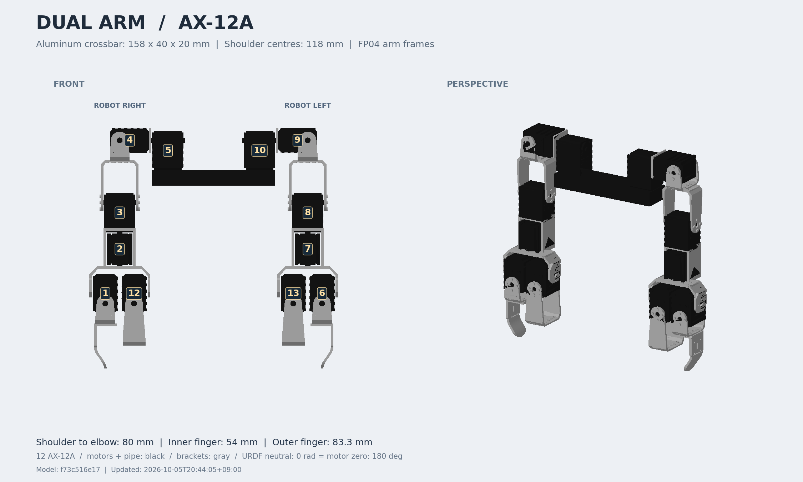
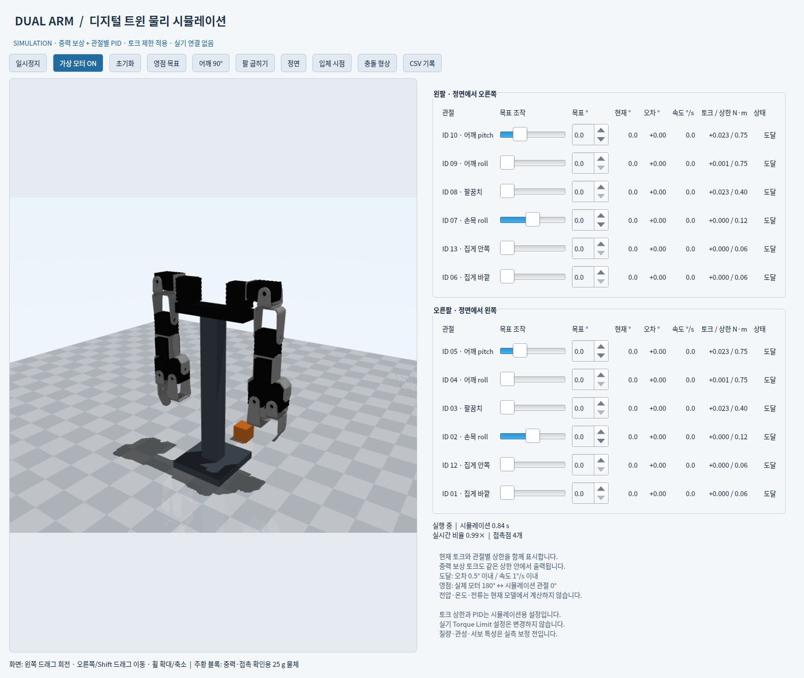

# AX-12A 양팔 로봇 — URDF와 디지털 트윈 시뮬레이션

ROBOTIS BIOLOID Premium에서 분리한 모터와 부속품으로 구성한 양팔 로봇의 **공식 FP04 부품 도면 치수를 반영한 사진 기반 모델**입니다. 사진에서 관찰되는 모터 6개와 비대칭 집게를 한쪽 팔로 구성하고, 좌우 두 팔을 158 × 40 × 20 mm 알루미늄 연결 파이프 위에 배치했습니다. `display.sh`는 프리뷰 전용입니다. 실제 AX-12A 보호 설정/구동은 별도 [dual_arm_hardware](src/dual_arm_hardware/README.md)와 `hardware.sh`에서 제공합니다. 현재 실기 연결 정보가 미입력되어 실제 장치에는 적용하지 않았습니다.



## 디지털 트윈 물리 시뮬레이션

`./simulation.sh` 또는 `./monitor.sh --sim`으로 **3D 물리 시뮬레이션 + 관절 조작 + 상태 모니터**를 엽니다. 12개 목표각을 조작하면 중력·관성·접촉과 관절별 시뮬레이션 토크 상한에 따라 움직이고, 계산된 현재각·오차·속도·토크/상한을 함께 확인할 수 있습니다. 중력 보상과 관절별 PID를 적용하며, 어깨 90° 시험 버튼, 모터 OFF/ON, 일시정지, 초기화, 카메라 조작과 CSV 기록을 지원합니다. 기존 `display.sh`는 RViz 형상 프리뷰입니다.

현재는 실물 보정 및 실기 동기화 전의 초기 물리 모델입니다. 상세 사용법과 검증 범위는 [dual_arm_simulation](src/dual_arm_simulation/README.md)을 참고하세요.



## 바로 보기

- `preview/dual_arm_viewer.html`: 브라우저에서 직접 열 수 있는 독립형 3D 뷰어. 인터넷이나 ROS 설치 없이 회전·확대, 관절 슬라이더, 기본/굽힘/집게 열기 자세를 사용할 수 있습니다.
- `preview/01_양팔_전체.png`: 최신 URDF의 정면·입체 이미지입니다.
- `preview/02_부품_형상_비교.png`: 도면에 따른 부품 세부 형상 수정 전후입니다.
- `preview/03_집게_90도_회전_비교.png`: 아래쪽 집게 방향의 수정 전후 기록입니다.
- `preview/04_표면_채움_비교.png`: 모터·프레임의 뚫려 보이던 면을 수정한 전후 비교입니다.
- `preview/05_손목_손_단차_비교.png`: 사진을 기준으로 손목 본체와 두 모터로 된 손의 중심선 단차를 수정한 측면 비교입니다.
- `src/dual_arm_description/urdf/dual_arm.urdf`: 이미 전개된 URDF입니다. 메시의 `package://dual_arm_description` 경로는 아래 빌드 후 ROS 패키지 검색 경로로 해석됩니다.

ROS 2 Humble + RViz:

```bash
cd /home/ktj/Dual_Arm
./display.sh
```

`display.sh`는 매번 **STL 메시 재생성 → 패키지 빌드 → Xacro에서 URDF 생성 → PNG/HTML 프리뷰 갱신**을 수행한 뒤 RViz와 Joint State Publisher GUI를 엽니다. `dimensions_file`, `mount_spacing`, `mount_height` 실행 인자는 프리뷰와 RViz 양쪽에 동일하게 적용됩니다. 프리뷰 하단/상단에서 갱신 시각을 확인할 수 있습니다. 슬라이더로 12개 관절을 각각 움직일 수 있습니다. 바닥 격자는 50 mm이며, RViz의 `Joint frames`를 켜면 관절 좌표축을 볼 수 있습니다.

RViz에는 PNG 생성에 사용한 전개 URDF 파일을 `urdf_file` 인자로 직접 전달합니다. 전체 프리뷰는 `01_양팔_전체.png` 한 장만 갱신하며, 해시를 이름에 붙인 중복 PNG는 만들지 않습니다. 이미지 하단의 `Model` 값과 갱신 시각으로 버전을 구분합니다. `preview/model_manifest.json`에는 형상 해시, 최신 PNG 경로, 사용한 URDF와 각 STL의 SHA-256이 기록됩니다. 형상 해시는 실제 메시·관절 데이터로만 계산합니다. 내용이 다른 과거 전체 이미지는 `preview/revisions/` 안에 보관하고, 내용이 같은 복사본은 제거했습니다.

`preview/02_부품_형상_비교.png`는 세부 형상 보완 직전과 현재 모델의 같은 축척 비교입니다. 이전 모델은 `preview/revisions/before_frame_detail/`에 보관했습니다. U자 꺾임, 나사 자리의 단차, F5 체결홀과 모서리, F11 장착홀·둥근 끝을 실제 STL에 추가했습니다. 세부 홈의 깊이와 곡률은 사진·도면 외형을 따른 근사이며 제조사 정밀 CAD가 아닙니다. 앞서 반영한 주요 길이는 유지했습니다.

바깥 집게의 아래쪽 F11은 U자 브래킷과의 체결 중심에서 Z축으로 90° 회전했습니다. 위쪽 F2의 방향은 유지하고, F11의 평평한 벽면을 왼팔에서는 +Y, 오른팔에서는 −Y 쪽에 배치했습니다. 굽은 끝은 집게 안쪽을 향합니다. 아래쪽 collision의 가로·세로도 회전한 외형에 맞췄습니다.

측면 사진 `20261004_183206.jpg`의 앞뒤 해석을 사용자 지시에 따라 바로잡았습니다. **두 모터로 된 손이 손목 본체보다 13 mm 앞쪽(+X)**에 위치합니다. 손목 모터의 긴 몸체는 출력축에서 −X로 뻗고 출력축은 −Z를 향합니다. 손목 본체 중심은 팔꿈치 본체 중심선(X=0)에 맞추고, 출력축과 손 전체는 X=+13 mm에 배치했습니다. 단차 13 mm는 단순화한 모터의 축–본체 중심 간격을 반영한 추정값이며 실측 확정값은 아닙니다. 손 모터 2개·손바닥 프레임·집게·tool0를 같은 조립체로 함께 이동했으며, 손목 모터와 손의 collision 및 질량중심도 일치시켰습니다. 손목 축은 혼에 맞춰 유지되며 케이스 장착 방향과 모터 영점은 별개입니다. 모든 모터 영점은 180°입니다. `wrist_axis_x`는 전완 기준 손목 출력축 위치(+0.013 m), `hand_mount_x`는 그 축에 대한 손 중심의 추가 장착 오프셋(현재 0 m)입니다.

모터와 프레임이 특정 방향에서 속이 빈 것처럼 보이던 문제도 수정했습니다. 기존 STL 생성 시 앞·뒷면의 삼각형 방향이 일치하지 않아 외부에서 보아야 할 면이 사라졌습니다. 각 입체의 면 방향을 바깥쪽으로 통일하고, 모터 글자에는 0.15 mm 두께와 앞·뒤·옆면을 추가했습니다. 모터·프레임 재질은 모두 불투명(`alpha=1`)입니다. 실제 체결 구멍과 U자 브래킷의 개방부는 유지했습니다. 작은 입체들을 조합한 시각화 메시이므로 서로 닿거나 겹치는 내부 면이 있으며, 제조용 단일 Boolean 솔리드는 아닙니다.

`preview/04_표면_채움_비교.png`는 이 수정 직전·직후의 같은 시점 비교입니다. PNG와 HTML 모두 면의 뒷면을 숨기도록 바꿔, 이전처럼 양면 렌더링이 잘못된 면 방향을 가리지 않도록 했습니다. `display.sh` 실행 시 모든 메시와 프리뷰를 재생성하며 이 비교 이미지도 갱신합니다. 기존 RViz는 종료 후 다시 실행해야 새 STL을 읽습니다.

프리뷰만 갱신하려면 ROS 노드와 창을 열지 않는 다음 명령을 사용합니다.

```bash
./display.sh --preview-only
```

이미 실행 중인 RViz는 새 파일을 자동으로 다시 읽지 않습니다. 해당 터미널에서 `Ctrl+C`로 종료한 뒤 `./display.sh`를 다시 실행하세요. 열려 있는 HTML 프리뷰도 다시 열거나 새로고침해야 합니다.

### RViz 시점 조작

상단의 **Move Camera**가 기본 도구입니다. 마우스를 로봇이 보이는 3D 화면 위에 놓고 조작합니다.

- 왼쪽 버튼 드래그: 로봇 주위를 회전
- 휠 스크롤 또는 오른쪽 버튼 드래그: 확대·축소
- `Shift` + 왼쪽 버튼 드래그 또는 휠 버튼 드래그: 화면을 상하좌우로 이동
- **Focus Camera**를 선택한 뒤 보고 싶은 부품의 표면 클릭: 그 지점을 회전 중심으로 지정. 이어서 휠로 확대하면 작은 부품을 보기 편합니다.
- `Views → Current View → Distance`에서도 거리를 직접 입력할 수 있습니다. 단위는 m입니다.

이전 설정에는 `Tools` 목록이 누락되어 있었습니다. [RViz Humble의 도구 로딩 코드](https://github.com/ros2/rviz/blob/humble/rviz_common/src/rviz_common/tool_manager.cpp)는 설정을 읽을 때 기존 도구를 비우므로, `MoveCamera`를 첫 번째 도구로 명시하고 `FocusCamera`, `Select`도 추가했습니다. 근접 관찰을 위해 `Near Clip Distance`는 0.001 m로 설정했습니다. [Orbit 마우스 처리 코드](https://github.com/ros2/rviz/blob/humble/rviz_default_plugins/src/rviz_default_plugins/view_controllers/orbit/orbit_view_controller.cpp)에서 위 회전·이동·확대 조작을 확인할 수 있습니다. 적용하려면 기존 실행을 종료하고 `./display.sh`를 다시 실행하세요.

직접 실행하려면:

```bash
source /opt/ros/humble/setup.bash
colcon build --symlink-install --packages-select dual_arm_description
source install/setup.bash
ros2 launch dual_arm_description display.launch.py
```

의존 패키지는 `xacro`, `robot_state_publisher`, `joint_state_publisher`, `joint_state_publisher_gui`, `rviz2`입니다. 이 작업 환경에는 설치되어 있습니다.

## 사진에서 반영한 부분과 가정

입력 사진은 `/home/ktj/Downloads/LocalSend/`의 다음 5개 파일입니다.

- `20261004_183154.jpg`: 양팔 전체와 좌우 배치
- `20261004_183157.jpg`, `20261004_183209.jpg`: 한쪽 팔의 앞·뒤 구조
- `20261004_183206.jpg`: 측면과 모터 축 배치 참고
- `20261004_183220.jpg`: 브래킷, 모터, 집게의 입체 형상 참고

반영한 구조는 검정 AX-12A 케이스, 회색 U자 브래킷, 직교하는 모터 연결, 나란한 집게 모터 2개, 길이가 다른 집게 끝입니다. 메시들은 FP04-F2/F4/F5/F11 도면의 주요 치수와 사진을 바탕으로 직접 만든 단순화 형상입니다. 제조사 CAD를 복제한 정밀 메시가 아니며, 도면에 치수가 없는 곡률·벽 두께·리브는 근사했습니다. 케이블과 작은 커넥터·리브 일부는 생략했습니다.

부품 구분을 위해 모터 전체(케이스·라벨·축·케이스 나사)와 알루미늄 연결 파이프는 검정색, 나머지 프레임(연결판·브래킷·집게·프레임 체결 나사)은 회색입니다. 이 색상은 URDF와 두 미리보기에 동일하게 적용됩니다.

설치된 RViz Humble은 한 링크의 첫 visual 재질을 다른 visual에도 적용하므로, 모터와 프레임이 섞인 어깨·전완·손바닥에서 색상이 잘못 표시되었습니다. 해당 회색 프레임을 고정된 표시 전용 링크(`*_frame_visual_link`)로 분리해 해결했습니다. 관련 구현은 [RViz Humble RobotLink](https://github.com/ros2/rviz/blob/humble/rviz_default_plugins/include/rviz_default_plugins/robot/robot_link.hpp)의 `createVisualizable`과 [재질 선택 함수](https://github.com/ros2/rviz/blob/humble/rviz_default_plugins/src/rviz_default_plugins/robot/robot_link.cpp)의 `getVisualWithMaterial`에서 확인할 수 있습니다. 기존 관절·도구 좌표·충돌 형상과 합산 관성은 원래 링크에 유지됩니다. 수정 후에는 기존 실행을 종료하고 `./display.sh`를 다시 실행해야 합니다.

어깨 바로 옆의 두 번째 모터는 긴 몸체가 안쪽의 첫 어깨 모터를 향하도록 눕혀 직접 연결했습니다. 양쪽 모터 몸체를 축 중심으로 서로 반대 방향으로 90° 회전했고, 두 번째 모터의 출력 브래킷은 아래팔 방향으로 내려갑니다. 몸체 방향은 사용자 설명을 반영했으며, 연결 간격은 여전히 추정값입니다.

AX-12A의 케이스 기준 치수 **32 × 50 × 40 mm**, 질량 **54.6 g**은 [ROBOTIS 공식 e-Manual](https://emanual.robotis.com/docs/en/dxl/ax/ax-12a/)을 기준으로 했습니다. 브래킷의 확인된 치수는 아래 표를 따릅니다. 모터 축의 케이스 내부 위치, 어댑터, 실제 체결 조합은 여전히 추정입니다. 모델 질량 약 1.0912 kg에는 알루미늄 연결 파이프 0.2 kg과 추정 브래킷 질량이 포함됩니다. 케이블·제어기·추가 지지대 질량은 포함하지 않습니다.

사용자 지정 **가로 158 × 세로 40 × 높이 20 mm, 질량 0.2 kg 알루미늄 파이프**를 `crossbar_link`로 추가했습니다. 가로는 좌우(Y), 세로는 앞뒤(X), 높이는 Z입니다. URDF에서는 **X/Y/Z = 0.040/0.158/0.020 m**로 변환합니다. 입력값은 `config/parts.yaml`의 `aluminum_crossbar`에 mm와 kg로 기록했습니다.

첫 어깨 모터 2개를 파이프 양 끝 윗면에 고정했습니다. 각 모터의 좌우 폭이 40 mm이므로 바깥면을 파이프 끝과 맞추면 모터 중심 간격은 **158 − 40 = 118 mm**입니다. 앞뒤 방향은 중앙에 배치하며, 모터 바닥과 파이프 윗면이 맞닿습니다. 체결홀과 브래킷은 추가 치수가 없어 모델에 추가하지 않았습니다.

파이프 벽 두께가 주어지지 않아 visual과 collision은 닫힌 외형 박스로 나타냈습니다. 질량은 지정값 0.2 kg이며, 관성은 그 질량을 외형 박스에 균일하게 분포시킨 근사입니다. 실제 중공 파이프의 정밀 관성은 아닙니다. `base_link`는 바닥 높이의 가상 기준 좌표로 유지하고, `base_link → crossbar_link → 좌우 mount_link`로 연결했습니다. 어깨 축 높이는 기존 390 mm를 유지하여 파이프 중심은 342 mm, 윗면은 352 mm입니다. 별도의 바닥 지지대는 모델링하지 않았습니다.

## 공식 도면 반영 (2026-10-04)

출처는 사용자가 제공한 [프리미엄 제품](https://www.robotis.com/shop/item.php?it_id=901-0006-100)과 [ROBOTIS Bioloid 공식 도면 다운로드센터](https://www.robotis.com/service/downloadpage.php?ca_id=7040)입니다. 2010년판 PDF를 직접 렌더링하여 치수를 확인했습니다. 원본 파일은 `/home/ktj/Downloads/FP04-F*.pdf`에 있으며, 제조사 CAD는 이 패키지에 재배포하지 않습니다.

| 도면 | 확인된 치수 (mm) | 모델 적용 및 식별 상태 |
|---|---|---|
| [FP04-F2](https://www.robotis.com/service/download.php?no=325) | 안쪽 폭 42, 바깥 체결면–축 26, 중앙 구멍 Ø8, 혼 PCD 16, 체결홀 Ø2.1, 격자 8 | 어깨 짧은 U자와 바깥 집게의 축 브래킷. 사진 기반 대응 추정 |
| [FP04-F4](https://www.robotis.com/service/download.php?no=333) | 안쪽 폭 42, 안쪽 체결면–축 52, 전체 길이 64.7, 체결면 폭 29 | 긴 상완 U자 및 안쪽 짧은 집게. 사진 형상 대응 |
| [FP04-F5](https://www.robotis.com/service/download.php?no=337) | 바깥 폭 78.5, 안쪽 폭 72.5, 측면 깊이 40, 측면 축–등판 29, 판 폭 28 | 집게 모터 둘을 감싸는 손바닥. 사진 형상 대응 |
| [FP04-F11](https://www.robotis.com/service/download.php?no=361) | 전체 길이 57.3, 깊이 29, 체결부 폭 32, 끝 폭 28 | 바깥 집게의 굽은 끝. 사진 형상 대응 |

FP04-F1/F3/F6–F10/F12/F51/F53도 비교했으나 확정되지 않은 연결판을 특정 부품으로 단정하지 않았습니다. 특히 어깨 연결 브래킷이 F1인지 F2인지 사진만으로 확정하기 어렵기 때문에, 현재는 제공된 F2 도면을 기준으로 한 구성입니다. F1은 축 오프셋이 다른 별도 형상이므로 실제 부품 확인 시 교체해야 합니다.

**도면 치수와 조립 추정은 다릅니다.** F4의 안쪽 체결면–축 52 mm에 도면에 명시되지 않은 뒤판 두께 2 mm를 더해 바깥면–축을 54 mm로 모델링했습니다. 따라서 상완 축 간격은 F2 26 + F4 54 = **80 mm**입니다. 실제 벽 두께나 조립 간극을 측정하면 달라질 수 있습니다. 짧은 집게는 F4 단독으로 축–끝 **54 mm**, 긴 집게는 F2 26 + F11 57.3 = **83.3 mm**로 배치했으며, 긴 집게의 두 부품은 체결면을 맞댄 것으로 가정했습니다.

F2/F4 측벽 두께 3 mm, 어깨 직접 연결판, 손목 어댑터, 집게 모터 간격 37 mm, 손바닥 축 높이 48 mm는 추정값입니다. F5 등판의 혼 구멍은 끝에서 22.25 mm로 비대칭이지만, 사진에서 사용한 체결홀을 확정하지 못해 손목–손바닥 중심 정렬은 기존 추정 배치를 유지했습니다. 부품 크기 보정이 완료된 시각화 모델이며, 실제 조립 치수 전체를 확정한 모델은 아닙니다.

모터 케이스의 실제 STL 경계도 40 × 32 × 50 mm (모델 X/Y/Z)에 맞췄습니다. 색상 구분을 위한 고정 표시 링크와 어깨 옆 모터의 안쪽 방향은 유지했습니다. `display.sh`는 빌드 후 설치된 최신 Xacro를 읽으므로 같은 치수를 사용합니다.

## 관절 구성

모터 번호는 **로봇 기준**입니다. 오른팔은 정면 사진의 왼쪽, 왼팔은 정면 사진의 오른쪽입니다.

| 관절 | 오른팔 ID | 왼팔 ID |
| --- | ---: | ---: |
| 안쪽 짧은 집게 (`inner_finger`) | 12 | 13 |
| 바깥쪽 긴 집게 (`outer_finger`) | 1 | 6 |
| 손목 (`wrist_roll`) | 2 | 7 |
| 팔꿈치 (`elbow_pitch`) | 3 | 8 |
| 바깥쪽 어깨 (`shoulder_roll`) | 4 | 9 |
| 파이프 위 어깨 (`shoulder_pitch`) | 5 | 10 |

11번은 사용하지 않습니다. 실기 설정은 [hardware.yaml](src/dual_arm_hardware/config/hardware.yaml), 표시용 번호는 [motor_calibration.yaml](src/dual_arm_description/config/motor_calibration.yaml)에 기록하며 `validate_model.py`가 두 설정의 일치를 검사합니다. 시뮬레이션 조작창·CSV와 PNG·HTML 프리뷰에도 번호가 표시됩니다. 기존 URDF 관절명과 TF 프레임명은 유지합니다. 이 설정은 기존 모터 번호와 관절의 대응을 지정하며, 실제 장치의 ID 레지스터를 변경하지 않습니다.

ROS 관례로 +X는 앞, +Y는 로봇의 왼쪽, +Z는 위입니다. `left`와 `right`는 로봇 기준이므로 정면에서 보면 반대편에 보입니다. 기본 자세는 팔이 아래로 내려가고 집게가 평행한 모델상의 0 rad입니다. 사용자 지정에 따라 **모든 모터의 영점은 180°**이며, **URDF 0 rad ↔ 모터 180°**로 대응합니다. 이 기준과 12개 관절 목록은 `config/motor_calibration.yaml`에 기록했습니다. Joint State Publisher와 HTML 슬라이더는 이 중립 자세로부터의 상대 각도를 표시합니다.

| 관절 접미사 | 용도 | 모델 축 | 모델 범위 |
|---|---|---|---|
| `shoulder_pitch_joint` | 어깨 전후 | −Y | −30° ~ +90° |
| `shoulder_roll_joint` | 어깨 좌우 | 왼팔 +X / 오른팔 −X | 0° ~ +90° |
| `elbow_pitch_joint` | 팔꿈치 | −Y | 0° ~ +90° |
| `wrist_roll_joint` | 손목 | −Z | −67.5° ~ +67.5° |
| `inner_finger_joint` | 안쪽 짧은 집게 | 왼팔 −X / 오른팔 +X | 0° ~ 30° |
| `outer_finger_joint` | 바깥쪽 긴 집게 | 왼팔 +X / 오른팔 −X | 0° ~ 30° |

각 이름 앞에는 `left_` 또는 `right_`가 붙습니다. 한쪽 팔은 팔 관절 4개 + 집게 관절 2개, 전체는 **12개 회전 관절 / 24개 링크**입니다. 24개 중 6개는 RViz 색상 구분을 위한 고정 표시 전용 링크이며, 질량·충돌 형상은 부모 링크에 포함되어 있습니다. 집게는 각각 실제 모터가 있으므로 `mimic`으로 묶지 않았습니다. 각 손의 `tool0`는 집게 사이의 임시 도구 기준점이며, 움직이는 접촉점을 계산하는 프레임은 아닙니다.

**모터 영점은 사용자 지정 180°입니다. 관절 축·회전 부호·가동 범위는 사진 해석에 따른 가정입니다.** 각 모터의 회전 부호와 조립 후 충돌 한계는 실측으로 확인해야 합니다. 현재 joint limit는 화면 조작용이고 전 구간 충돌 회피를 보장하지 않습니다. `effort=0.30 Nm`는 모델용 임시 메타데이터이며, 실제 토크 제한을 실행하지 않습니다. 사용자 요청으로 RViz와 HTML 프리뷰의 이동 속도 제한을 해제했습니다. URDF의 유한한 velocity 값은 메타데이터로 유지하지만 현재 프리뷰에는 적용하지 않습니다. 질량과 박스 관성, 단순 collision 형상은 편집의 출발점이며, 동역학이나 실기 제어용 보정은 수행하지 않았습니다. 모터 ID는 사용자가 표시한 정면 사진과 오른팔 번호 확인에 따라 아래처럼 배정했습니다.

## 관절 제한 적용 경로

`config/joint_limits.yaml`에서 12개 관절의 각도(도), 속도(도/초), URDF effort(N·m)를 관리합니다. Xacro에서 rad로 변환하여 `<limit>`에 넣습니다. 현재값은 실측 전 임시 범위입니다. 어깨의 안쪽 기울임과 팔꿈치의 뒤쪽 굽힘은 0°에서 제한합니다. 실제 충돌 없는 가동 범위로 인증한 값은 아닙니다.

실행 경로는 `Joint State Publisher GUI → /preview/joint_targets → limited_joint_state_publisher → /joint_states → robot_state_publisher / RViz`입니다. GUI와 GUI 없는 JSP 모두 RViz와 동일한 URDF 파일을 읽으며, GUI는 그 각도 한계 안에서만 목표를 선택합니다. 출력 노드는 범위를 넘는 목표를 경계값으로 제한한 뒤 다음 발행 주기(30 Hz)에 바로 반영합니다. 이동 속도 보간은 없습니다. HTML 슬라이더와 자세 버튼도 같은 각도 범위 안에서 즉시 자세를 바꿉니다.

변경 적용 후 기존 RViz/Joint State Publisher 실행을 종료하고 `./display.sh`를 다시 실행해야 합니다.

출력 노드는 이름 중복·누락·알 수 없는 관절·NaN/Inf가 있는 입력을 한 묶음 전체 거부합니다. 정상 목표 입력이 0.5초 끊기면 마지막 표시 자세를 유지하며, 이미 오래된 목표는 뒤늦게 적용하지 않습니다. velocity와 effort 피드백은 만들어 내지 않습니다. 이 경로는 **합성 프리뷰 전용**이며 실제 모터의 측정 `/joint_states`를 이 제한기에 넣으면 안 됩니다. 실기/물리 시뮬레이터를 붙일 때는 프리뷰 발행기를 끄고 실제 상태 발행기를 사용해야 합니다.

`display.sh`는 RViz 기구학 프리뷰입니다. 물리 엔진, 중력·접촉 토크 계산, 충돌 회피, 가속도/jerk 제한은 없습니다. 별도 실기 구동기 `dual_arm_hardware`는 CW/CCW Angle Limit, Max Torque/Torque Limit, 과열·과부하 Shutdown을 적용하고 재조회한 뒤 활성화를 허용합니다. 실제 연결 정보와 출력 상한이 설정되지 않아 아직 모터에 적용하지 않았습니다. [실기 설정 및 실행 안내](src/dual_arm_hardware/README.md)를 확인하세요. Torque Limit은 N·m가 아닌 출력 비율이고 전원을 켜면 Max Torque 값으로 초기화됩니다. [ROBOTIS AX-12A 공식 제어표](https://emanual.robotis.com/docs/en/dxl/ax/ax-12a/#control-table)

검증 명령:

```bash
source /opt/ros/humble/setup.bash
PYTHONNOUSERSITE=1 /usr/bin/python3 src/dual_arm_description/scripts/test_preview_limits.py
```

2026-10-04 검증: 속도 제한 해제 후 위 7개 회귀 검사(즉시 자세 적용, 방향 반전, 각도 경계, 잘못된 입력, 오래된 입력 등)와 HTML의 즉시 반영/각도 제한/NaN 검사를 통과했습니다. 설치된 Humble GUI의 12개 슬라이더 양 끝 및 Randomize는 앞선 화면 없는 Qt 실행에서 확인했습니다. ROS 노드 기동은 확인했으나 작업 환경의 DDS 소켓 권한 제한으로 실제 노드 간 토픽 전달과 사용자 RViz 화면은 확인하지 못했습니다.

## 치수 수정

주요 설정은 `src/dual_arm_description/config/dimensions.yaml`에 있습니다. 조립 설정 단위는 m, kg, rad입니다. 파이프 치수는 `config/parts.yaml`의 `*_mm` 항목에 mm로 입력하며, 메시와 URDF 생성 시 m로 변환합니다.

| 설정 | 현재값 | 의미 |
|---|---:|---|
| `mount_spacing` | 자동 0.118 | 기본값은 파이프 길이 − 모터 폭 0.040; 실행 인자로 재정의 가능 |
| `mount_height` | 0.390 | 첫 어깨 축 높이; 파이프도 함께 이동 |
| `shoulder_outboard` | 0.040 | 첫 어깨 출력면에서 두 번째 어깨 축까지; 긴 몸체 끝을 직접 연결 |
| `upper_arm_length` | 0.080 | 두 번째 어깨 축에서 팔꿈치 축까지 |
| `wrist_drop` | 0.082 | 팔꿈치 축에서 혼 바깥 체결면 및 손목 원점까지 |
| `palm_drop` | 0.048 | 혼 바깥 체결면에서 집게 축까지 |
| `wrist_axis_x` | +0.013 | 전완 기준 손목 출력축 X 위치; 손목 본체 중심은 X=0 |
| `hand_mount_x` | 0.000 | 손목 출력축 기준 손 중심의 추가 X 오프셋 |
| `finger_spacing` | 0.037 | 집게 모터의 두 축 사이 거리 |
| `short_finger_length` | 0.054 | 짧은 집게 축에서 끝까지 |
| `long_finger_length` | 0.0833 | 긴 집게 축에서 끝까지 |

표준 부품 메시를 관절 간격에 맞춰 늘리는 스케일링은 제거했습니다. `dimensions.yaml`은 조립 위치·도구 좌표 등을 정합니다. 부품 형상은 `config/parts.yaml` 및 메시 생성 스크립트에서 수정한 뒤 STL을 재생성합니다. 두 파일을 변경할 때 체결면 일치·collision·추정 관성도 함께 점검해야 합니다.

`shoulder_outboard`는 모터 축에서 몸체 끝까지의 모델 길이 0.038 m보다 커야 합니다. 차이값을 짧은 연결판 두께로 사용하며, 기본값에서는 2 mm입니다.

전체 조립체의 높이를 실행 시 바꿀 수도 있습니다. `mount_spacing`을 별도로 지정할 경우 고정된 파이프 길이와 모터의 지지 범위를 함께 확인해야 합니다.

```bash
./display.sh mount_height:=0.45
```

YAML 또는 Xacro를 수정한 뒤 배포용 URDF와 미리보기를 갱신합니다.

```bash
source /opt/ros/humble/setup.bash
source install/setup.bash
xacro src/dual_arm_description/urdf/dual_arm.urdf.xacro \
  -o src/dual_arm_description/urdf/dual_arm.urdf
PYTHONNOUSERSITE=1 MPLCONFIGDIR=/tmp/dual_arm_mpl \
  python3 src/dual_arm_description/scripts/export_preview.py
```

미리보기 재생성에는 시스템 `python3-numpy`, `python3-matplotlib`가 필요합니다. 이 환경의 사용자 설치 matplotlib와 시스템 mplot3d가 충돌하므로 위 명령은 시스템 패키지를 사용합니다. 생성된 HTML에는 모든 메시가 포함되어 있어 재생성 후에도 별도 서버가 필요 없습니다.

STL 형상 재생성은 `python3 src/dual_arm_description/scripts/generate_meshes.py`로 수행합니다. `display.sh`의 자동 갱신에는 시스템 `python3-numpy`, `python3-vtk9`, `python3-yaml`, `python3-matplotlib`가 필요하며, 이 환경에 설치되어 있습니다. 스크립트는 `/usr/bin/python3`와 `PYTHONNOUSERSITE=1`을 사용해 사용자 설치 matplotlib 충돌을 피합니다. 이미 생성된 모델을 위의 직접 ROS launch 명령으로 보는 경우에는 메시·프리뷰 생성용 의존성이 필요 없습니다.

## 실기 상태 모니터

실기 구동기와 별도 터미널에서 `./monitor.sh`를 실행하면 12개 모터의 현재각·목표각·속도·부하·전압·온도·토크 ON/OFF·토크 제한 비율과 오류를 볼 수 있습니다. `./monitor.sh --csv`는 수신 값을 `log/monitor/`에 기록하고, `./monitor.sh --demo`는 연결 없이 예시 화면을 보여줍니다. 모니터는 읽기 전용이며, 수신이 없으면 `WAITING`, 중단되면 `STALE`로 표시합니다. 사용법은 [dual_arm_monitor](src/dual_arm_monitor/README.md)를 참고하세요.

## 검증 기록

2026-10-04, 현재 워크스페이스에서 다음을 확인했습니다.

- `colcon build --symlink-install --packages-select dual_arm_description` 성공
- Xacro 전개 및 `check_urdf` 파싱 성공
- 24개 링크 / 12개 회전 관절 / 11개 고정 관절, 순환 없는 연결 구조 확인
- 파이프 외형 158 × 40 × 20 mm, 질량 0.2 kg, 어깨 간격 118 mm 및 모터 바닥–파이프 윗면 접촉 확인
- RViz Humble이 사용하는 링크 첫 visual 기준으로 모든 모터와 연결 파이프는 검정, 나머지 프레임은 회색임을 검사
- AX-12A / F4 / F5 STL 경계 치수, U자 안쪽 폭 42 mm, 표준 부품의 스케일 1, 상완 축 간격 80 mm 확인
- 모든 STL의 유한 좌표·유효 삼각형, 양의 질량과 양의 정부호 관성 확인
- 모든 STL의 열린 가장자리 0개, 방향이 맞지 않는 가장자리 0개, 양의 둘러싸인 부피 및 불투명 재질 확인
- 박스의 여섯 방향 외부 면, 뒤집힌 윤곽의 체결 구멍 보존, 분리된 입체 각각의 방향, 누락된 면 거부 회귀 검사 통과
- 좌우 관절 기준점 대칭, 12개 관절 변환, 집게 두 갈래의 독립성 확인
- 실행 인자의 양팔 간격·높이 변경 반영 확인
- 생성된 URDF의 정면·입체 렌더링을 시각적으로 검토
- HTML 스크립트 문법 검사 통과

검증 명령:

```bash
check_urdf src/dual_arm_description/urdf/dual_arm.urdf
python3 src/dual_arm_description/scripts/validate_model.py
PYTHONNOUSERSITE=1 /usr/bin/python3 src/dual_arm_description/scripts/test_mesh_geometry.py
```

실시간 검증의 한계: ROS launch 인자 조회와 robot_state_publisher의 전체 링크 로딩까지 확인했습니다. 현재 샌드박스는 DDS 소켓 생성과 데스크톱 X 화면 접속을 허용하지 않아 joint state/TF 전달 및 RViz 화면은 확인하지 못했습니다. 브라우저 도구도 `file://` 접근을 정책상 차단하여 HTML의 실제 브라우저 상호작용 검증은 수행하지 못했습니다.

다음 실측에서는 관절 중심 간 거리, 축 방향, 배정한 모터 ID와 실제 버스 응답의 일치 여부, 중립 자세의 encoder 값, 집게 개폐 방향과 안전 가동 범위를 확인하면 됩니다.
